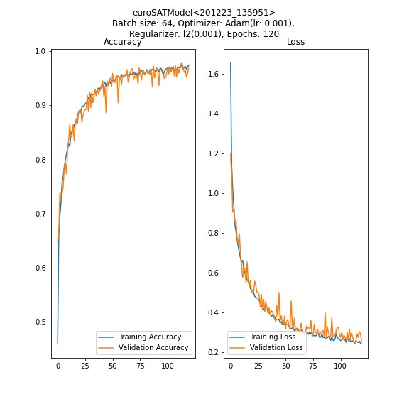

#EuroSAT  
alleetw101 <2020.12>

## Architecture

Layer (type)                 Output Shape              Param #    
rescaling_22 (Rescaling)     (None, 64, 64, 3)         0         
conv2d_88 (Conv2D)           (None, 64, 64, 16)        448       
max_pooling2d_88 (MaxPooling (None, 32, 32, 16)        0         
conv2d_89 (Conv2D)           (None, 32, 32, 32)        4640      
max_pooling2d_89 (MaxPooling (None, 16, 16, 32)        0         
conv2d_90 (Conv2D)           (None, 16, 16, 64)        18496     
max_pooling2d_90 (MaxPooling (None, 8, 8, 64)          0         
conv2d_91 (Conv2D)           (None, 8, 8, 128)         73856     
max_pooling2d_91 (MaxPooling (None, 4, 4, 128)         0         
dropout_22 (Dropout)         (None, 4, 4, 128)         0         
flatten_22 (Flatten)         (None, 2048)              0         
dense_66 (Dense)             (None, 256)               524544    
dense_67 (Dense)             (None, 128)               32896     
dense_68 (Dense)             (None, 10)                1290      
=================================================================  
Total params: 656,170  
Trainable params: 656,170  
Non-trainable params: 0  

## Performance (10 Runs)

Loss (Mean: 0.4515, Std: 0.0205)  
Accuracy (Mean: 0.9092, Std: 0.0068)

## Dataset

EuroSAT dataset containing 27000 RGB 64x64 labelled satellite images.

https://github.com/phelber/eurosat

@article{helber2019eurosat,
  title={Eurosat: A novel dataset and deep learning benchmark for land use and land cover classification},
  author={Helber, Patrick and Bischke, Benjamin and Dengel, Andreas and Borth, Damian},
  journal={IEEE Journal of Selected Topics in Applied Earth Observations and Remote Sensing},
  year={2019},
  publisher={IEEE}
}
@inproceedings{helber2018introducing,
  title={Introducing EuroSAT: A Novel Dataset and Deep Learning Benchmark for Land Use and Land Cover Classification},
  author={Helber, Patrick and Bischke, Benjamin and Dengel, Andreas and Borth, Damian},
  booktitle={IGARSS 2018-2018 IEEE International Geoscience and Remote Sensing Symposium},
  pages={204--207},
  year={2018},
  organization={IEEE}
}

## Specifications

### Project

Python 3.8  
Tensorflow 2.4  

### Development

Macbook Pro

CPU: 2.9 GHZ (i7-7820HQ)  
GPU: None utilized  
RAM: 16 GB  
OS: macOS 11.1 (Big Sur)  
PyCharm 2020.2 (CE)  

Google Colab

## Appendix:
Performance:  
Loss: [0.4798467755317688, 0.4365072548389435, 0.4337463974952698, 0.4345245659351349, 0.4656313359737396, 0.44807326793670654, 0.4280368387699127, 0.4609622359275818, 0.4860413372516632, 0.44183796644210815]  
Accuracy: [0.9018518328666687, 0.9111111164093018, 0.9129629731178284, 0.9140740633010864, 0.8974074125289917, 0.9137036800384521, 0.9196296334266663, 0.903333306312561, 0.9066666960716248, 0.9118518233299255]  
